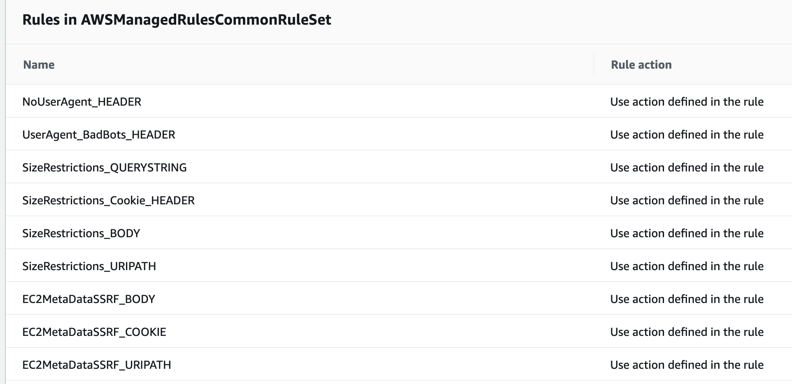
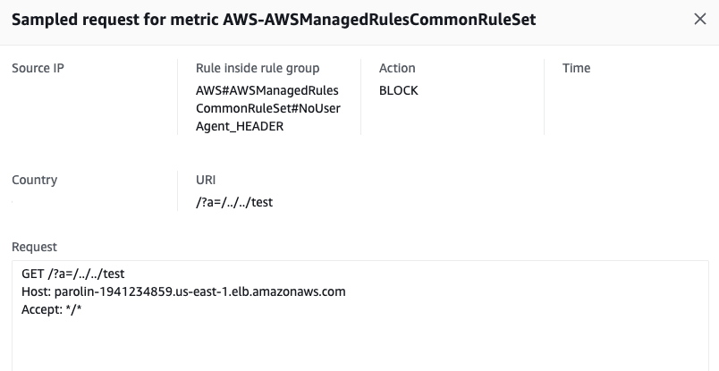
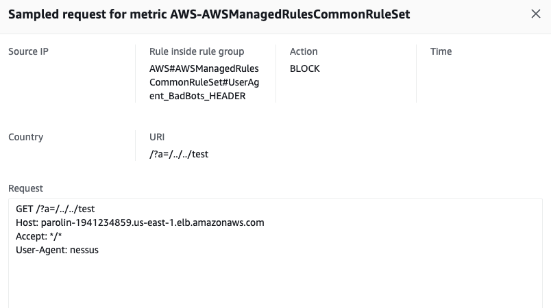
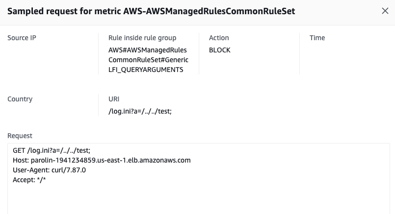
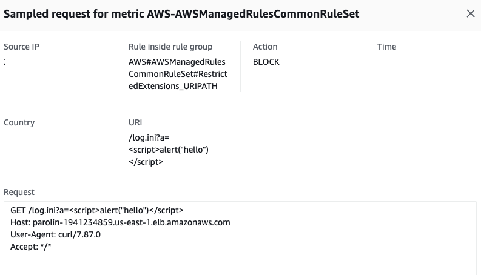
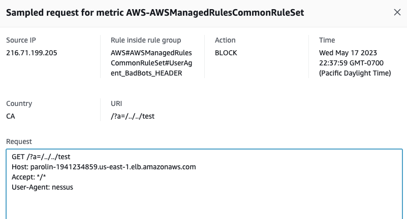

A couple of days ago, in one of slack channels that I participate, someone asked what was the order of evaluation for the AMR (AWS Managed Rules) used in the AWS WAF (Web Application Firewall).

Although it may have a logical answer, the [oficial documentation](https://docs.aws.amazon.com/waf/latest/developerguide/aws-managed-rule-groups.html) does not really provide information in the order the rules are evaluated. 

Does not matter how obvious it may sound, you should never assume something. Always test and confirm.

That is what we will try to do here.

By default, the rules that you write and add in your AWS WAF are evaluated by the "priority" assigned to each rule. The rule with the lowest priority value is evaluated first, followed by the rule with the next lowest priority value, and so on. Would the same apply for the AMR? That is easy to check and validate.

I will not provide a step by step instruction of how to create the lab environment (adding WAF into ALB/CF/API Gw and setting up a WebACL). I may do it in another post, but as of now, if you need help in adding AMR rules into your AWS WAF WebACL, I recommend you to look into the [AWS WAF Official Documentation](https://docs.aws.amazon.com/waf/latest/developerguide/getting-started.html).

### Picking random rules.

For the tests I am using an Application Load Balancer (ALB) with AWS WAF with 1 AMR rule group.

I selected the Core rule set (CRS) managed rule group. Below a snapshot of how the rule group appears in the WebACL. 

From the snapshot we can see the possible order of the rules. 

The first and second rules exclude each other. The first one, as per [official documentation](https://docs.aws.amazon.com/waf/latest/developerguide/aws-managed-rule-groups-baseline.html#aws-managed-rule-groups-baseline-crs) says that the rule inspects for requests that are missing the HTTP `User-Agent` header, while the second rule inspects for common User-Agent header values that indicate that the request is a bad bot.

We can have a rule where the User-Agent is a bad bot or we don't have the User-Agent header. We cannot have both. Based on this we send requests that contains data that fits two distinct rules and we will see which rule blocked the request.

We will test 5 rules and from there assumes that the behavior for these rules are the same for the other 17 rules.

We will test the following rules
* NoUserAgent_HEADER
* UserAgent_BadBots_HEADER
* GenericLFI_QUERYARGUMENTS
* GenericLFI_URIPATH

Below a breakdown of the rule, its intention and how we can test the rule.

|Rule: |  `NoUserAgent_HEADER`|
|---|---|
|Description:  |  Inspects for requests that are missing the HTTP User-Agent header.|
|Payload for test:  |  `curl -vo /dev/null http://parolin-1941234859.us-east-1.elb.amazonaws.com/ -H "User-Agent: "`|

|**Rule:**  | `UserAgent_BadBots_HEADER`|
|---|---|
|**Description:**|Inspects for common User-Agent header values that indicate that the request is a bad bot.|
|**Payload for test:**|`curl -vo /dev/null http://parolin-1941234859.us-east-1.elb.amazonaws.com/ -H "User-Agent: nessus"`|

|**Rule:** | `GenericLFI_QUERYARGUMENTS`|
|---|---|
|**Description:** |Inspects for the presence of Local File Inclusion (LFI) exploits in the query arguments.|
|**Payload for test:** |`curl -vo /dev/null http://parolin-1941234859.us-east-1.elb.amazonaws.com/?a=../../../`|

|**Rule:**  |`RestrictedExtensions_URIPATH`|
|---|---|
|**Description:** |Inspects for requests whose URI paths contain system file extensions that are unsafe to read or run.|
|**Payload for test:** |`curl -vo /dev/null http://parolin-1941234859.us-east-1.elb.amazonaws.com/log.ini`|

|**Rule:**  |`CrossSiteScripting_QUERYARGUMENTS`|
|---|---|
|**Description:** |Inspects the values of query arguments for common cross-site scripting (XSS) patterns.|
|**Payload for test:** |`curl -vo /dev/null 'http://parolin-1941234859.us-east-1.elb.amazonaws.com/log.ini\?a\='`|

### Test & Confirming

I am using my ALB's URL, so you need to adjust the command to reach out your own resource. 

Let's send a request that matches the rules `NoUserAgent_HEADER`and `GenericLFI_QUERYARGUMENTS`

`curl -vo /dev/null 'http://parolin-1941234859.us-east-1.elb.amazonaws.com/?a=/../../test' -H "User-Agent: "`

*As expected, the rule that blocked the request was the `NoUserAgent_HEADER` rule that has a higher priority (comes first) in the rule group.*

---

Request that test `UserAgent_BadBots_HEADER` and `GenericLFI_QUERYARGUMENTS`:

`curl -vo /dev/null 'http://parolin-1941234859.us-east-1.elb.amazonaws.com/?a=/../../test' -H "User-Agent: nessus"`

*As expected, the rule that blocked the request was the `UserAgent_BadBots_HEADER` that has a higher priority (comes first) in the rule group*

---

Request that test `GenericLFI_QUERYARGUMENTS` and `RestrictedExtensions_URIPATH`

`curl -vo /dev/null 'http://parolin-1941234859.us-east-1.elb.amazonaws.com/log.ini?a=/../../test'`

*As expected, the rule that blocked the request was the `GenericLFI_QUERYARGUMENTS` that has a higher priority (comes first) in the rule group*

---

Request that test `RestrictedExtensions_URIPATH` and `CrossSiteScripting_QUERYARGUMENTS`

`curl -vo /dev/null 'http://parolin-1941234859.us-east-1.elb.amazonaws.com/log.ini\?a\='`

*As expected, the rule that blocked the request was the `RestrictedExtensions_URIPATH` that has a higher priority (comes first) in the rule group*

---

Request that test `UserAgent_BadBots_HEADER` and `CrossSiteScripting_QUERYARGUMENTS`

`curl -vo /dev/null 'http://parolin-1941234859.us-east-1.elb.amazonaws.com/?a\=' -H "User-Agent: nessus"`

*As expected, the rule that blocked the request was the `UserAgent_BadBots_HEADER` that has a higher priority (comes first) in the rule group*

---

When using AMR rule groups, the rules that are displayed on the top are the ones that will block the request first. Based on the test, we can assume that the rules are evaluating requests in the same order that they are dissplayed on the rule group.

Hope it helps. 🤘

