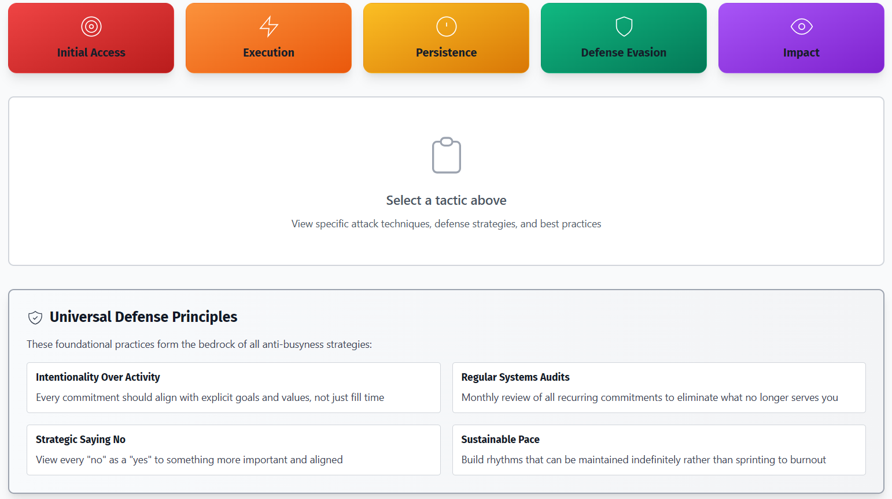

Last week, I stumbled upon this site: [https://www.cisotradecraft.com/bitns](https://www.cisotradecraft.com/bitns) and I really liked it.

It made me think about all the teams I've worked on, the different managers I've had, the roles I've played, and the companies I've worked for.

<!--more-->

Anyone who works in security knows this: an attack rarely starts with something big and impactful. Most of the time, it begins with a small access, an extra permission, a poorly monitored process, a typo, etc. This mock version of the MITRE ATT&CK framework made me realize that in the corporate world, something very similar happens. The difference is that we are the target.

At first, everything looks legitimate. A new project here, a meeting there. Suddenly, you realize you’re running in *persistent execution mode*: always online, always available, always "just one more task." No sophisticated exploit was needed — just well-crafted social engineering, with phrases like "it’s only for this week", "I need this and it's urgent" or "everyone does it".

Then comes involuntary *privilege escalation*: more responsibility, less autonomy. You start operating on autopilot, responding to alerts (emails, chats, calls) without time for proper analysis or meaningful improvements. It feels like an overloaded SOC — too many events, too little context, too little time.

And it gets worse. The most dangerous part? Silent *exfiltration*. Not of data, but of energy, creativity, and motivation. No alarms go off, no incident is declared, but when you finally notice... something important is already gone. And the attacker? Well, the system itself — one that rewards being busy instead of being effective.

What I like about the BITNS framework is that it shows how good security practices apply here too:
* **Principle of least privilege** → not everything needs a "yes"
* **Continuous detection** → notice burnout signals early
* **Time for threat modeling** → think before reacting

In the end, being busy doesn’t mean being secure, effective or productive — not in corporate environments, and not in life. Sometimes, the best compensating control is to stop, review, and ask: *does this really need to run this way?*
